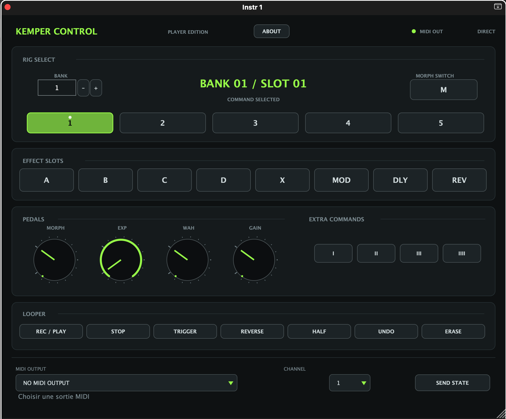

# KemperControlDAW



KemperControlDAW is an open-source JUCE MIDI control interface for the Kemper Player, designed to bring clear, visual Kemper control directly into a DAW.

It is designed for Logic Pro, Ableton Live and other DAWs, allowing musicians to automate Kemper changes throughout a song or backing track without entering MIDI CC values manually.

## Features

- Bank and slot selection with discrete values from 1–124 and 1–5.
- Direct rig selection for slots 1–5.
- Effect slot controls for A, B, C, D, X, MOD, DLY and REV.
- Morph, expression, wah and gain controls.
- Dedicated Morph Switch control for the currently selected rig.
- Extra commands I, II, III and IIII.
- Dedicated looper controls for Rec / Play, Stop, Trigger, Reverse, Half, Undo and Erase.
- MIDI output and channel selection directly from the interface.
- Automation-friendly parameters for programming changes throughout a song.

## Installation

Precompiled plugin versions are available in the [Releases](https://github.com/adriendoespostrock/KemperControlDAW/releases) section.

### VST3 — Ableton Live

Copy:

```text
Kemper Control.vst3
```

to:

```text
~/Library/Audio/Plug-Ins/VST3
```

Then open Ableton Live and rescan the plugins from:

```text
Preferences → Plug-Ins → Rescan
```

### AU — Logic Pro

Copy:

```text
Kemper Control.component
```

to:

```text
~/Library/Audio/Plug-Ins/Components
```

Then restart Logic Pro. If necessary, open:

```text
Logic Pro → Settings → Plug-in Manager
```

and reset or rescan the plugin.

## Using KemperControlDAW with Ableton Live

1. Create a MIDI track.
2. Load the `Kemper Control` VST3 plugin on that track.
3. Open the plugin interface.
4. In **MIDI OUTPUT**, select your Kemper Player MIDI port.
5. Select the MIDI channel used by the Kemper.
6. Use the interface to select banks, slots, effects, pedals and looper commands.

The plugin sends MIDI directly to the selected MIDI output. No additional MIDI routing track is required.

To automate changes:

1. Click **Configure** in the Ableton plugin device.
2. Click the parameters you want to automate.
3. Create automation lanes for Bank, Slot, effects, pedals or looper commands.
4. Draw the changes directly into the arrangement.

Bank and Slot use discrete values, so intermediate values cannot be selected.

## Using KemperControlDAW with Logic Pro

1. Create a new **External MIDI Track**.
2. Set the MIDI destination to your Kemper Player.
3. Select the appropriate MIDI channel.
4. Insert `Kemper Control` as an Audio Unit MIDI FX plugin.
5. Open the plugin interface.
6. Select the Kemper MIDI output and channel inside the plugin.
7. Automate the available parameters from the Logic automation lanes.

The plugin can be used to automate rig changes throughout a song or backing track. The Morph Switch simulates pressing the currently selected rig a second time, allowing the Kemper to switch between its base and Morph states.

## Testing without a Kemper

The plugin can also be tested with a virtual MIDI port, MIDI Monitor or IAC Driver.

Select the virtual MIDI port in the plugin’s **MIDI OUTPUT** menu and use a MIDI monitor to inspect the messages being sent.

The plugin does not generate audio. The VST3 version includes a silent audio output only for compatibility with DAWs that require instrument plugins to provide an audio bus.

## Notes

- This release is intended for macOS.
- The Kemper Player must be connected and visible as a MIDI output to receive commands.
- The plugin does not read the Kemper’s current state; it sends MIDI commands based on the selected controls and automation.

## About

KemperControlDAW was developed by Adrien Deurveilher, guitarist of [When Waves Collide](https://www.youtube.com/@WhenWavesCollide).

## Just so you know
Just for transparency: this app was vibe-coded with AI. I'm not a professional developer, just a guitarist who wanted to build a useful tool for the Kemper Player.
